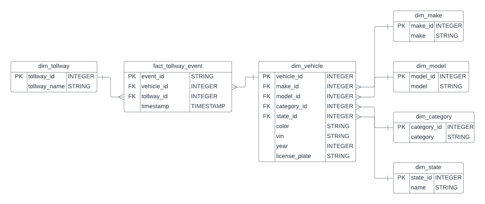
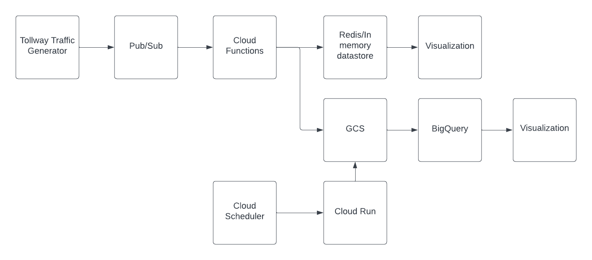
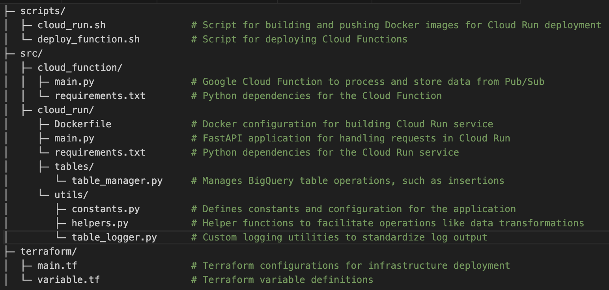

# Overview

This project is designed to automate the ingestion, transformation, and storage of tollway traffic data using a fully managed, serverless architecture on Google Cloud Platform (GCP). The synthetic tollway traffic data is created using a streaming data generator I built. To view more about this project, please go [here](https://github.com/BenGriffith/tollway-traffic).

# Architecture

## Diagrams
**Entity Relationship Diagram (ERD)**: This diagram provides a visual representation of the data model used within BigQuery. It details how different entities such as vehicles, tollways, and events are interlinked.

**System Workflow**: This diagram outlines the complete data flow through the system, from the initial data generation by the Tollway Traffic Generator through to processing and storage.

1. **Tollway Traffic Generation**: Simulated traffic data is sent to Pub/Sub.
2. **Pub/Sub**: Publishes tollway traffic to a topic with a push and pull subscription.
    - For the push subscription, Cloud Functions is invoked to process and write the most recent message to Cloud Memorystore/Redis. Here, the most recent tollway traffic events will live temporarily and be used for light-weight metrics/visualizations.
    - For the pull subscription, Cloud Scheduler triggers a Cloud Run service to read the most recent batch of tollway traffic events and write them to BigQuery to be used for various analytic use-cases.

# Directory Structure

# Setup and Deployment

## Prerequisites
* Google Cloud account and project setup.
* Google Cloud SDK and Terraform installed.
* The Pub/Sub pull subscription can be created manually or follow what is outlined [here](https://github.com/BenGriffith/tollway-traffic) for the Pub/Sub component.

## Environment Variables
* Set necessary variables in `cloud_run.sh` and `variable.tf`.

## Configuration
1. **Terraform Initialization**
    - Navigate to the `terraform` directory and execute `terraform init`.
2. **Deployment**
    - In project root, execute `make infra-up` to create the infrastructure.
